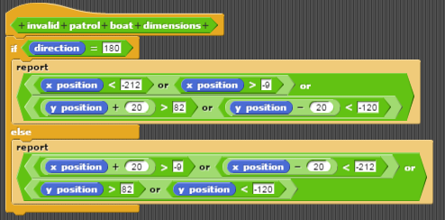

# Warm-up: Twenty Questions

To get started, a simple implementation of the popular game "Twenty Questions" will introduce some of the main concepts of NetsBlox. The game goes as follows: one person thinks of something. The other person has 20 yes/no questions to guess what it is. If it is not guessed within 20 chances, the guesser loses. Simple enough, right? The most important parts to consider are as follows:

*   Two roles (guesser & answerer)
*   How to start the game (answerer thinking of something) 
*   How to play the game (guessing the answer) 
*   How to stop the game (correct guess/20 questions are up)

Right off the bat, you can see that there's a need for communication between the two players-- this is where the concept of _messaging_ comes into play. The guesses from the guesser will have to be visible to the answerer in order to verify them. Below is a simple example of how you can achieve this.

The message "guess" will be sent to the "answerer" with the variable "answer" holding the guess from the guesser (the blue "answer" variable is just the standard variable used by Snap! for every input). To verify this guess, blocks on the answerer's side could look something like below.

These blocks signify that once the answerer receives the guesser's yes/no question, he answers it and sends that answer back to the guesser. This is the core foundation behind an implementation of the game, and shows how simple yet powerful messages can be. Below is how you could go about creating the entire game, with a few extra things added in that enhance the user experience such as annotations and changing light sprites based on turn.  

To quickly demonstrate the potential of remote procedure calls and server support, the following is how you could implement "Twenty Questions" using the RPC provided:

Notice how concise, readable, and elegant the blocks are. Additionally, this RPC even provides much more functionality than the client-based version. To name a few, the server safeguards against invalid user input/actions, automatically stops the game if the guesser enters the correct answer, keeps track of variables such as guess count & player turn, and more.

# Example Implementation: Battleship

Now that the concepts of messages and rooms have been introduced, let's add remote procedure calls into the mix and implement _Battleship_. If you're unfamiliar with this game, you can view the rules [here](http://www.hasbro.com/common/instruct/Battleship.PDF). As with "Twenty Questions", it's best to be aware of the most important parts/features of the game. Below is a reasonable list of key features/needs that Battleship requires:

*   2 game boards
*   5 game pieces (ships)
*   Way to map positions on grid -> coordinates
*   Way to "fire" at enemy ships
*   Way to keep track of sunken ship parts/ships

With these features, you can see how server-side support would be helpful. That is where the Battleship RPC comes in play. It will help keep track of the game grids and ships. It will also give support in executing the game. Because of the nature of this turn-based game, both roles will have similar blocks, the only difference being who the messages are sent to. Thus, I recommend creating the blocks for one role and cloning them over (adjusting the sender/receiver) to avoid unnecessary work.  

To start off, we will need 2 "game boards". For this implementation, we will be using the boards below.

Now we will need 5 game pieces of the appropriate size (2-5 spaces). For this implementation, we will be using the ships below.

    

Now we will need to figure out a way to map the position of a ship on the grid to the specific coordinates that the Battleship RPC needs (row/column). First, we must understand the orientation methodology of the Battleship RPC. As found in the wiki, if a patrol boat is placed at (I, 2) and (I, 3), it should be placed on the board as (I, 2) facing west. Similarly, if it's placed at (I, 2) and (H, 2), it should be placed on the board as (I, 2) facing north. You can track the x and y position of a ship under the "motion" block category. Similarly, you can track the x and y position of your mouse under the "sensing" block category.  

For this implementation, a list was created for each ship in order to compactly contain the data. For instance, the "patrol boat info" list contains 4 items, 1) whether it is placed or not, 2) whether the orientation is upright or not, 3) the row, and 4) the column. To map the position of the ship to the appropriate row/column, you will need to analyze the x/y coordinates of each "space" on the grid and convert them into row and column numbers. See below for setting the position of an upright patrol boat for reference.

For calculating and converting the coordinates of the ships into row/column numbers, a little mathematical analysis is required. Take note of the boundaries of the board as well as the size that each space occupies in order to accurately convert the dimensions. Below is the thought process behind what was implemented for this example:

Because the bottom of the grid is at y: -120, to calculate the row of the ship you have to add 120 (because this coordinate system is positive-based), then add 10 (half of each block's height because the y position of a sprite lies in the middle of the block) for every block over 1 that the ship is (because the y position of a ship increases with its length in the upright orientation). For example, in the case of a patrol boat, because it occupies 2 blocks, you add 10 to the original 120\. Then, you divide by the size of a block (20 in this case). Additionally, you must round down to avoid rounding errors (without rounding the row number would increase ahead of the ship). To calculate the column, because the left side of the grid is at x: -210, you have to add 210 (again, because this coordinate system is positive-based) and divide by the size of each block (20), rounding down. Because each ship always has the same x position with the upright orientation, this is the same calculation for all ships. Following that same methodology, the blocks for setting the coordinates of a patrol boat in the side orientation would be as shown below.

For each bigger ship after, you will begin to recognize patterns in the differences of the numbers. Use these!  

After calculating the row/column of each ship, we need to figure out a way to actually "place" them on the grid. Again, this is where the Battleship RPC comes in play. Below is how you could use the "place" block to correctly place a ship on the grid in the correct orientation (remember item 2 of the list is whether it is upright or not).

Next would be to figure out a way to "fire" at the enemy ships. This is pretty straightforward. The logic should be as follows: if you click on a valid space on the "enemy ships" grid, the x/y coordinates will be converted to row/column numbers, where the Battleship RPC will execute the "firing". See below.

Now all we need is to figure out how to keep track of sunken ship parts/ships and end the game. Thankfully, the Battleship RPC has a custom block that we can use to determine the number of active ships in play. Additionally, every time we "fire", each person receives a "miss" or "hit" message as defined in the wiki. We can use this to manage the sinking of ships. For example, below is a sample block structure that can be used to portray a sunken ship.

Additionally, you could use this to determine when all the ships of a player has sunk:

The key to any project is identifying what each custom RPC block can do. Realizing that each person receives a "your turn" message after the enemy has fired, you can combine the two to signify the player's loss as shown ibelow.

Now that all of the core features in place, this is where you can add in your own features and ideas. Be creative! This implementation added: boundaries for placing ships, snapping into position, collision detection, and reset/restart, among others.

This will report whether or not the patrol boat is in a valid position. Use the boundaries of the game board to determine the coordinates that are playable.

You can follow that with this in order to reset the ship's position and make sure the player picks a valid spot. 

This block calculates the closest space for a ship by figuring out where it is relative to a valid space and moving accordingly. Moreover, you can detect whether or not it's touching another ship like shown below.

Essentially, like the implementation of "Twenty Questions", the core concept underlying Battleship is simple; the extra features are what take some thought and time. To efficiently create a game, you must think of the most important parts, usually features like how to start the game, play the game, and stop the game. After thinking of these things, it's easy to structure the program in a way that you don't have to rework it over and over. Make use of custom blocks and RPCs, they're there to help you.  
