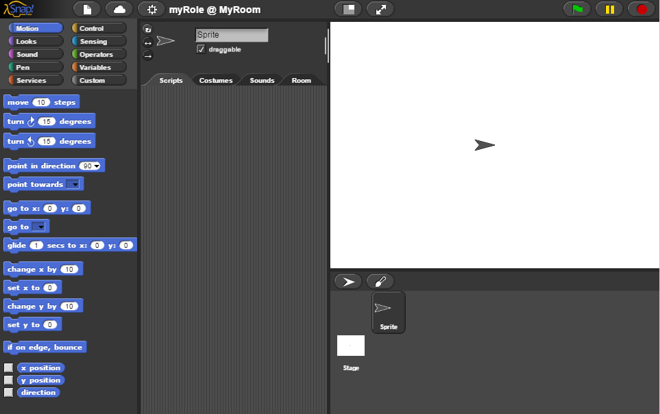
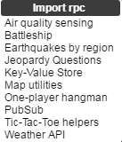
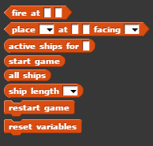
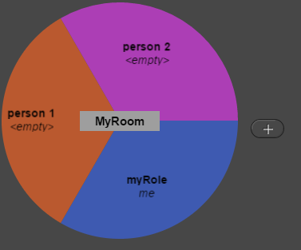

# Welcome

Welcome to Netsblox! This visual programming environment can be very powerful once you understand the concepts underlying it. There are three main ideas behind NetsBlox that make it unique--*messages*, *rooms*, and *remote procedure calls*. 

# Getting Started

This is the landing page and editor for NetsBlox. You can access it [here.](http://editor.netsblox.org) Note how similar the environment looks to Snap!'s. This is because NetsBlox is just an extension to Snap!, providing the networking capabilities. If needed, you can learn more about Snap! specifically and how to use it [here.](http://snap.berkeley.edu/SnapManual.pdf)

# Messages

*Messages* are one of the three main ideas behind NetsBlox. Similar to the `broadcast` block in Snap!, messages can be thought of as ``broadcasts` to other people. Essentially, when you send a message to another person in the same *room* (explained later), the other person can have a listener block (similar to a "when I receive broadcast" block in Snap!) and execute certain blocks when he/she receives the message. Additionally, messages can carry variables which make it easy to communicate valuable information among people such as whose turn it is or how many points a player scored in the game.

# Remote Procedure Calls

 

*Remote Procedure Calls* (RPCs for short) provide server support and can help with some of the more complicated and intricate parts of a project. To import an RPC, click the white document at the top of the page and click "Remote Procedure Calls...". Once imported, the server support can be utilized in the form of custom blocks. For example, above is what can be see after importing the "Battleship" RPC. These blocks are calls to the NetsBlox server, executing scripts written on the server. For instance, the "start game" block "places" all the ships on the grid, keeping track of what coordinates they are at and their state. It is best to first understand exactly what each block does. You can do this by visiting the wiki of the RPC. For the Battleship RPC, you can see what each custom block does [here.](https://github.com/NetsBlox/NetsBlox/wiki/Battleship-RPC)

# Rooms

A *room* is the messaging platform for the application. It allows different people, or "roles", to be in the same room. Messages can only be sent and received among roles in the same room. To manage the room
for the application, click the "Room" tab (next to "Sounds", "Costumes",and "Scripts"). From here, you can add/remove roles, invite/kick people, and clone an entire role's blocks. In the above screenshot, there are 3 people ("myRole", "person 1", and "person 2") in the same room ("myRoom"). All of these clients have access to the privilege of messaging each other.
