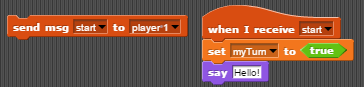

# Welcome

Welcome to Netsblox! This visual programming environment can be very powerful once you understand the concepts underlying it. There are three main ideas behind NetsBlox that make it unique--*messages*, *rooms*, and *remote procedure calls*. 

#### Jump To:
[Messages](#messages)  
[Remote Procedure Calls](#rpcs)  
[Rooms](#rooms)  

# Getting Started

This is the landing page and editor for NetsBlox. You can access it [here.](http://editor.netsblox.org) Note how similar the environment looks to Snap!'s. This is because NetsBlox is just an extension to Snap!, providing the networking capabilities. If needed, you can learn more about Snap! specifically and how to use it [here.](http://snap.berkeley.edu/SnapManual.pdf)

<a name="messages"/>
# Messages

*Messages* are one of the three main unique attributes of NetsBlox. Similar to the `broadcast` block in Snap!, a message can be thought of as a `broadcast` to other people. Essentially, when you send a message to another person in the same *[room](#rooms)*, the other person can listen for it and execute certain commands when he/she receives the message. Additionally, messages can carry variables which make it easy to communicate valuable information among people in the *[room](#rooms)* such as whose turn it is or how many points a player scored in the game. To view all of the available blocks for messages, click on the "services" block category tab in the top-left corner of the environment:

Above is the block to use to send a message. There are two drop-down menus. The first one expects the *message type* to be sent. A message type can be thought as a unique name given to a specific message that holds variable(s). To create a message type, click on the `Make a message type` block located in the same area as the other message blocks.  

The following window should pop up:  

Here you can see that a message type is composed of two parts: a name, and the variables (or `fields`) that it holds. Let's create a message type named "test" with the field "score". After creating it, you are then able to select it in the `send msg` drop-down:

Notice that there is a white space labeled "score" that appears next to the message type. This is where you can send whatever variable or value that you need to. For example, you could create a variable named "score" and then send it as follows: 

The second drop-down is for the recipient of the message:

 

As you can see above, the only recipients able to be selected are "player 2" and "everyone". That is because the *[room](#rooms)* only has one other person in it, as seen below. 

Note: the "everyone" recipient is everyone *but* you. (So in this case, everyone is just player 2). 
To receive a message, simply place a `when I receive msg` block. 

There is only one drop-down menu. Since we created the "test" message type, we are able to select it. Note: you will need to create a message type for each role in the room that uses it.

After clicking the "test" message type, you can see that the variable "score" is able to be used!

<a name="rpcs" />
# Remote Procedure Calls

 

*Remote Procedure Calls* (or RPCs for short) provide server support and can help with some of the more complicated and intricate parts of a project. To import an RPC, click the white document at the top of the page and click "Remote Calls...". Once imported, the server support can be utilized in the form of custom blocks. 

  
For example, above is what can be see after importing the "Battleship" RPC. These blocks are calls to the NetsBlox server, executing scripts written on the server. For instance, the `start game` block places all the ships on a grid, keeping track of what coordinates they are at and their state (sunk or not). It is best to first understand exactly what each block does before using it. You can do this by visiting the wiki of the RPC. For the Battleship RPC, you can see what each custom block does [here](https://github.com/NetsBlox/NetsBlox/wiki/Battleship-RPC). To see an example of an implementation utilizing the Battleship RPC, go to the "examples" section of this documentation.

<a name="rooms" />
# Rooms

A *room* is the messaging platform for the application. It allows different people, or "roles", to communicate with each other. Messages can only be sent and received among roles in the same room. In NetsBlox, each new application starts with a room with just the app creator. To manage the room for the application, click the "Room" tab (next to "Sounds", "Costumes",and "Scripts"):

  
From here, there are many actions you can take.

To add a role, click the plus button:  

To rename a role, click the name of the role. 

For all other actions, click on the empty space of the role:

If you click on the empty space of the role that you are currently occupying, the only action you will be able to do is clone yourself.

